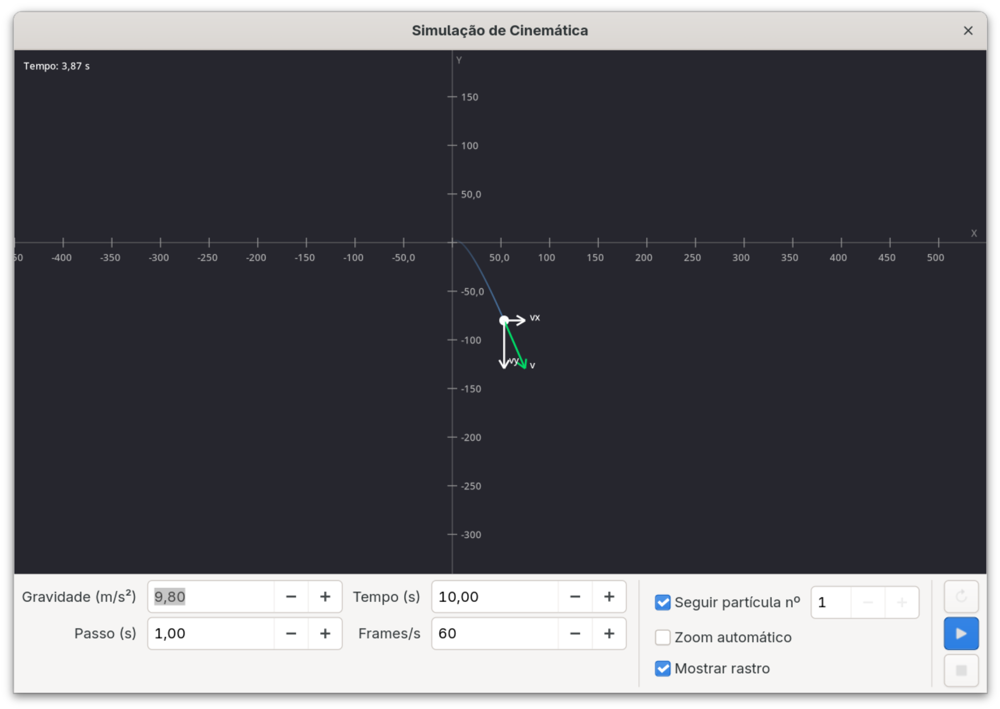
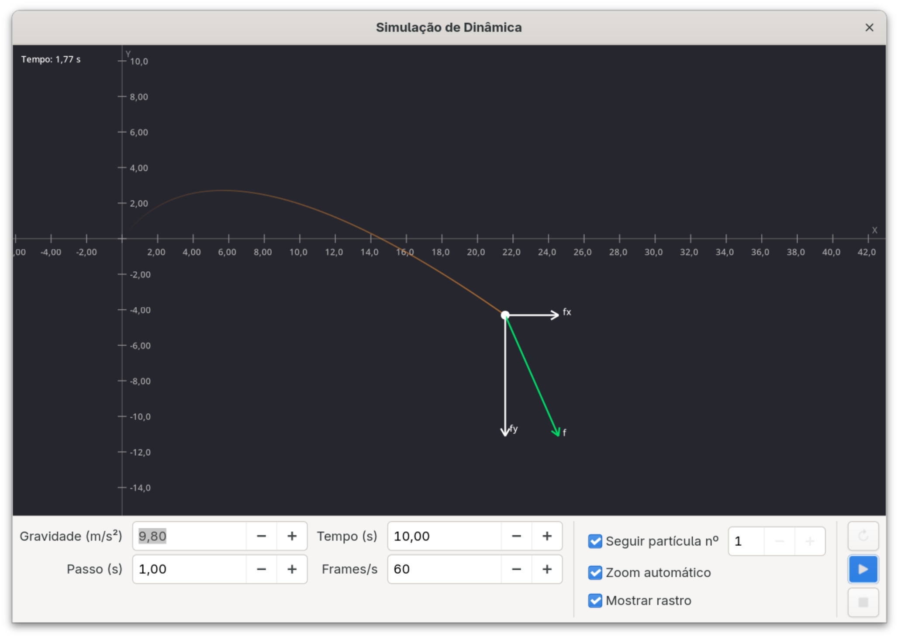

# physics-simulator

Aplicação desktop em GTK4 que simula física de partículas em dois modos — cinemático e dinâmico — desenvolvida para a cadeira de Programação e Algoritmos.

[](LICENSE)


[](https://en.cppreference.com/w/c)
[](https://www.gnu.org/software/make/)
[](https://docs.gtk.org/gtk4/)

Português | [English](README.md)

## Sobre

Simulador de partículas com dois modos independentes. No modo cinemático as partículas seguem trajetórias com aceleração constante; no modo dinâmico a segunda lei de Newton é aplicada com forças e gravidade configuráveis. A interface é construída com GTK4 e Blueprint, e as simulações são renderizadas com Cairo.

## Modos de simulação

| Modo           | Descrição                                                                                      |
| -------------- | ---------------------------------------------------------------------------------------------- |
| **Cinemático** | Aceleração constante — posição e velocidade actualizadas via s = s₀ + v·t + ½·a·t².            |
| **Dinâmico**   | Aceleração variável — força resultante dividida pela massa origina a aceleração em cada passo. |

## Funcionalidades

- **Gráficos vetoriais**: Renderiza partículas, velocidades e forças com as suas magnitudes e direções usando Cairo.
- **Controlos de simulação**: Inicie, pare e reinicie simulações ajustando os passos de tempo, frames por segundo, duração e gravidade.
- **Controlos de câmara**:
  - **Zoom automático**: Escala dinamicamente a área visível para focar todas as partículas.
  - **Seguir partícula**: Foca a câmara numa partícula específica, mantendo-a centralizada.
- **Rastos**: Desenha o percurso histórico das partículas.
- **Exportação de dados**: Guarda automaticamente registos detalhados da simulação em ficheiros CSV, contendo posições, velocidades e forças a cada instante.
- **Projetos**: Guarde e carregue as simulações através de ficheiros de projeto `.sabino`.

## Capturas de ecrã

<table>
<tr>
<td width="50%" valign="top"><br>Simulação cinemática</td>
<td width="50%" valign="top"><br>Simulação dinâmica</td>
</tr>
</table>

## Multimédia

- [Capturas de ecrã](media/screenshots)
- [Vídeos de demonstração](media/videos)

## Requisitos

| Ferramenta         | Versão |
| ------------------ | ------ |
| GCC                | 9+     |
| Make               | 4+     |
| GTK4               | 4.0+   |
| Blueprint Compiler | 0.8+   |
| Cairo              | 1.16+  |
| GLib               | 2.0+   |

Testado em Fedora/GNOME. Execução nativa em macOS não é suportada.

## Como executar

```bash
make run          # compilar e lançar o simulador
make all_tests    # executar todos os testes unitários
make clean        # remover artefactos de build
```

## Licença

Distribuído sob a licença **MIT**, © 2024 Nycolas Souza.

O texto completo está em [LICENSE](LICENSE).
